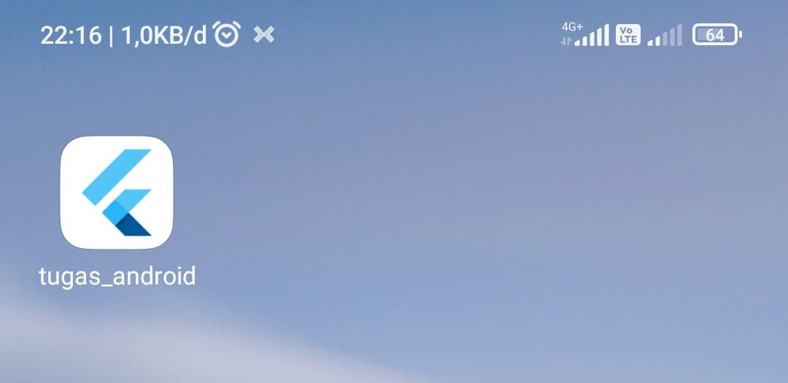
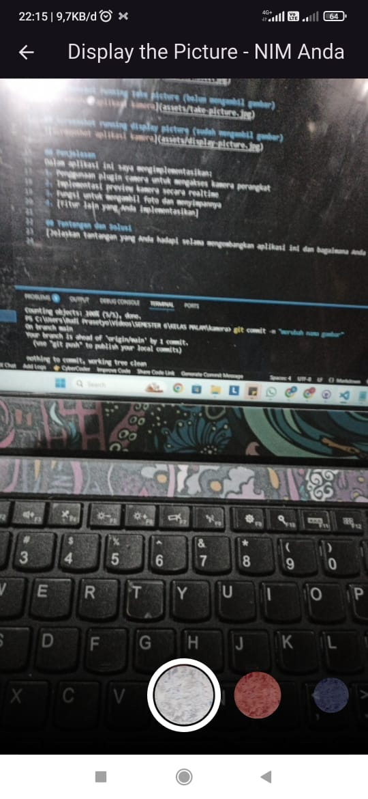

# Praktikum 3: Aplikasi kamera yang bisa menerapkan filter pada gambar yang sudah di ambil

## Deskripsi
Aplikasi ini merupakan implementasi kamera pada Flutter yang memungkinkan pengguna untuk mengambil foto menggunakan kamera perangkat dan setelah mengambil foto, pengguna dapat menerapkan filter pada gambar yang sudah di ambil.

## Screenshot Hasil

## Screenshot running display picture (sudah mengambil gambar)

## Penjelasan
1. pengguna dapat mengambil gambar pada aplikasi
2. pengguna dapat memilih filter yang ingin diterapkan pada gambar yang sudah di ambil
3. pengguna dapat melihat hasil gambar yang sudah diterapkan filter
4. pengguna dapat menyimpan hasil gambar yang sudah diterapkan filter ke galeri perangkat (belum di implementasikan)
5. pengguna dapat mengulangi proses mengambil gambar dan menerapkan filter (belum di implementasikan)

## Tantangan dan Solusi
1. Tantangan: mengambil gambar menggunakan kamera perangkat dan menerapkan filter